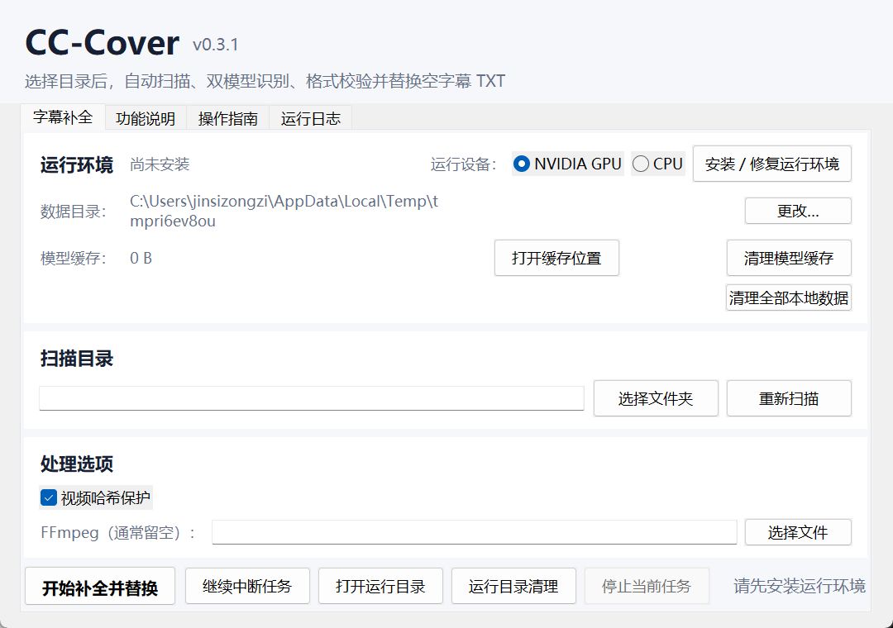
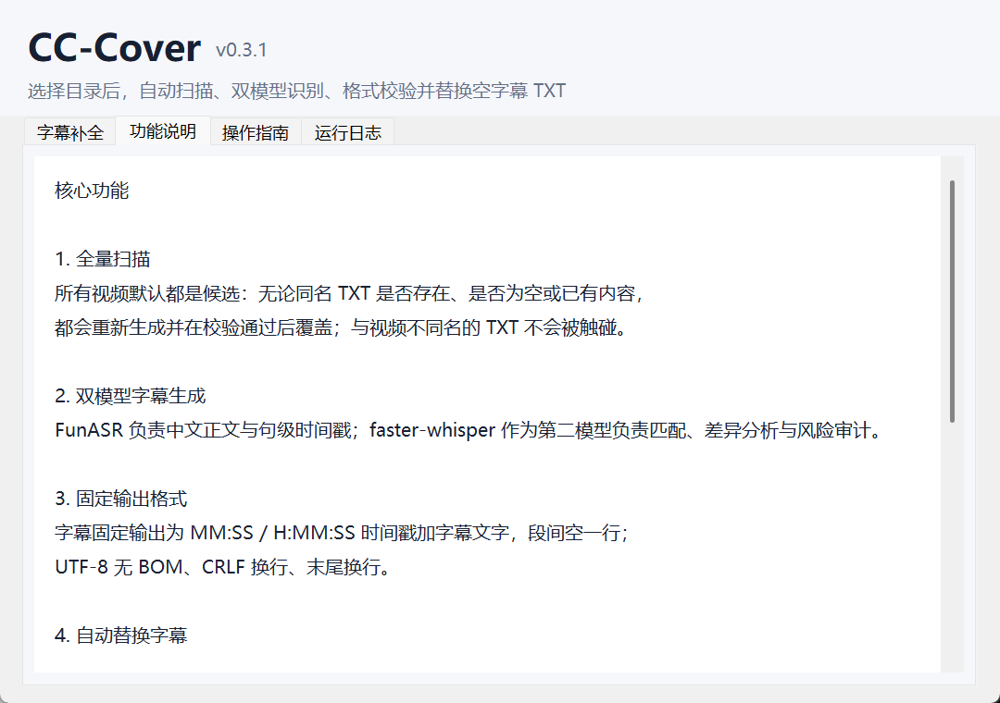
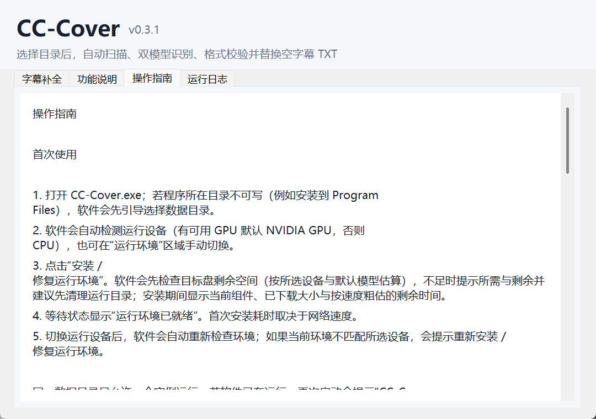

# CC-Cover

CC-Cover 是一款 Windows 图形化字幕补全软件。用户在软件中选择需要扫描的视频文件夹，CC-Cover 会把所有视频作为候选，为每个视频生成同名 TXT 字幕：无论同名 TXT 是否存在、是否为空或已有内容，都会使用 FunASR 与 faster-whisper 生成和审计字幕，按固定格式输出，并在校验通过后直接替换或创建同名 TXT。

软件不预设任何扫描目录，不需要 PowerShell、CMD 或额外写回参数。

## 下载与启动

1. 打开项目的 [Releases](https://github.com/Jinsizongzi/cc-cover/releases) 页面。
2. 按偏好选择两种发布物之一：
   - **安装器 `CC-Cover-Setup-<版本>.exe`**：默认安装到 `%LOCALAPPDATA%\Programs\CC-Cover`（当前用户，无需管理员权限），可自选目录；从开始菜单或桌面快捷方式启动，卸载走系统“设置 → 应用”。
   - **绿色便携包 `CC-Cover-<版本>-portable.zip`**：解压到任意可写目录，双击 `CC-Cover.exe` 即可使用，无需安装；数据根默认是程序所在目录。
3. 双击启动软件。
4. 若程序所在目录不可写（例如解压到只读位置），软件会先引导选择数据目录。
5. 首次使用时，软件会自动检测运行设备（有可用 GPU 默认 NVIDIA GPU，否则 CPU），也可在“运行环境”区域手动切换；确认后点击“安装 / 修复运行环境”。安装前会先检查目标盘剩余空间（按所选设备与默认模型估算，目标盘随数据根联动），不足时提示所需与剩余并建议先清理运行目录；安装期间显示当前组件、已下载大小与按下载速度粗估的剩余时间。
6. 环境状态显示“运行环境已就绪”后，即可选择扫描目录。

首次安装依赖和首次下载模型需要联网。数据根默认是程序所在目录（便携模式），固定包含 `venv\`、`model-cache\`、`runs\`、`temp\` 与 `settings.json`；可在“运行环境”区域点击“更改…”切换数据根。切换后旧目录保留，新目录需重新安装运行环境，模型缓存可手动复制以跳过重新下载。软件不会写入用户选择的视频目录之外的字幕文件。

同一数据目录只允许一个实例运行；若 CC-Cover 已在运行，再次启动会提示“CC-Cover 已在运行”并退出，同时尝试切换到已打开的窗口。

## 使用流程

1. 点击“选择文件夹”，提供需要扫描的视频目录。
2. 软件自动快速扫描并列出所有视频与其同名 TXT；同 stem 冲突会被标记并默认排除。
3. 检查候选列表，确认冲突与受保护文件。
4. 点击“开始补全并替换”。
5. 在“运行日志”页面查看双模型处理进度。
6. 完成后查看提示，或点击“打开运行目录”检查审计报告与备份。

软件内部提供完整的“功能说明”和“操作指南”页面（界面底部标签页）。

## 主要功能

- 图形化选择扫描目录，无默认扫描路径。
- 所有视频默认都是候选；同名 TXT 是否存在、是否为空或已有内容都会处理。
- FunASR 负责中文正文与句级时间戳。
- faster-whisper 负责第二模型对照和冲突审计。
- 字幕固定输出为 MM:SS / H:MM:SS 时间戳加字幕文字，段间空一行；UTF-8 无 BOM、CRLF 换行、末尾换行。
- 通过质量与格式校验后自动原子替换目标 TXT。
- 发现阶段检测同 stem 多视频指向同一目标 TXT 的冲突，默认不处理、不写回，报告列出相关视频。
- 写回前备份，批量失败时自动回滚。
- 记录视频与受保护字幕的文件快照，变化时拒绝写回。
- 运行设备合并为单一“运行设备”选择（NVIDIA GPU / CPU），启动时自动检测默认值，切换后自动复检环境；CLI 保留 `--device auto/cuda/cpu`。支持视频哈希保护选项；不再提供“包含纯空白 TXT”“创建缺失 TXT”选项。
- 数据根可配置：默认便携模式（程序所在目录），仅配置一个数据根，不提供逐项路径覆盖。
- 提供实时日志、候选列表、环境安装和中断任务恢复。
- 提供「运行目录清理」入口（时间/状态/大小、勾选删除，不自动删除），总占用超过 5GB 时提示建议清理；每次运行在运行目录生成 summary.txt 摘要，完成/失败提示可直达本次运行目录。
- 开始前确认框（将处理 N 个视频并替换同名 TXT，含已排除数量，替换前自动备份）；进度条显示「第 N / 共 M 个」+ 百分比 + 已用时长 + 粗估剩余时间；完成弹窗含总耗时、写回数量与告警数量（可跳转 summary.txt）及「打开本次运行目录」按钮；运行超过 5 分钟的任务完成后播放 Windows 提示音。
- 磁盘预检与安装进度：安装 / 修复前检查目标盘剩余空间（按所选设备与默认模型估算，目标盘随数据根联动），不足时明确提示「至少需要 N GB，当前剩余 M GB」并建议先清理运行目录；安装期间显示当前组件（如 3/6）、已下载大小与按下载速度粗估的剩余时间。
- 缓存与数据管理：运行环境区显示模型缓存占用，提供「打开缓存位置」「清理模型缓存」按钮（清理前确认需重新下载）；提供「清理全部本地数据」按钮（删除 venv/模型缓存/运行记录/临时文件，删除前确认并显示总占用，删除后需重新安装运行环境）。

## 数据安全

- 与视频不同名的 TXT（如 notes.txt）不会被触碰；同 stem 多视频的冲突默认不处理、不写回。
- 扫描到的受保护非空 TXT 会记录 SHA-256，并在写回前后复核。
- 视频默认记录 SHA-256，运行期间变化会终止写回。
- 输出先写入独立运行目录，再执行格式校验和质量门禁。
- 每个目标 TXT 在替换前都会保存备份。
- 写回失败时回滚本次已经替换的文件。
- 视频、音频和字幕识别均在本机执行。

## 运行产物

每次运行会保存：

- `manifest.json`：候选快照、配置和运行阶段。
- `engines/funasr/*.json`：FunASR 原始结果。
- `engines/faster_whisper/*.json`：faster-whisper 对照结果。
- `audits/*.json`：逐段匹配和冲突审计。
- `prepared/*.txt`：通过校验的最终字幕。
- `backups/*`：替换前的目标文件备份。
- `commit_report.json`：写回报告。
- `verification.json`：最终复核报告。
- `summary.txt`：人读运行摘要（起止时间、总数、成功/失败/告警明细、写回清单与路径）。

## 系统要求

- Windows 10 或 Windows 11。
- Python 3.10、3.11 或 3.12。首次安装环境时由软件自动检测。
- NVIDIA GPU 推荐；没有兼容 GPU 时可选择 CPU。
- 磁盘空间：首次安装运行环境并下载默认模型，约需 **CPU 版 5.8GB / NVIDIA GPU（CUDA）版 8.5GB**（安装前软件会按所选设备与数据根所在磁盘自动预检）。另需为视频、抽出的音频与运行产物预留空间，运行目录占用过高时可用「运行目录清理」回收。
- 网络与时长：首次安装依赖（pip）与首次运行下载模型（FunASR、faster-whisper）都需要联网；耗时主要取决于带宽，安装界面会显示当前组件、已下载大小与按速度粗估的剩余时间。

## 常见问题与排错（FAQ）

### 运行 exe 时 Windows 提示“Windows 已保护你的电脑”（SmartScreen）

当前发布物未购买代码签名证书，首次运行可能出现 SmartScreen 拦截。点击“更多信息” → “仍要运行”即可。请从官方 [Releases](https://github.com/Jinsizongzi/cc-cover/releases) 页面下载，不要使用来路不明的副本。付费签名（Azure Trusted Signing / OV）已列入后续计划。

### 杀毒软件报毒

未签名程序可能被个别杀软误报。处理步骤：

1. 确认文件来自官方 Releases 页，与发布说明中的版本、大小一致（可另用文件哈希比对）。
2. 将误报程序提交给对应厂商申诉。常用入口：
   - Microsoft：[Microsoft 安全智能误报提交](https://www.microsoft.com/wdsi/filesubmission)（选择“误报”）。
   - 360：360 软件误报申诉平台。
   - 火绒：火绒安全误报反馈。

### 安装运行环境时模型或依赖下载失败

首次安装会联网下载 PyTorch 等依赖，首次运行会下载 FunASR（ModelScope）与 faster-whisper（HuggingFace）模型到数据根 `model-cache\funasr`、`model-cache\faster-whisper`。失败常见原因与处理：

- 网络不通或代理问题：确认可正常访问外网；如有代理，让软件进程走系统代理。
- 磁盘空间不足：参考「系统要求」预留空间，并用「运行目录清理」腾出空间。
- 部分下载中断：重新点击“安装 / 修复运行环境”或重新运行，已下载部分可复用。

### 提示抽音频失败或找不到 FFmpeg

转写前需要把视频抽出音频。软件默认使用内置 FFmpeg；若视频损坏、编码不受支持，或指定了不可用的 FFmpeg，会在此步失败。处理：

- 确认视频本身可以正常播放（用播放器验证）。
- 在“处理选项”的“FFmpeg（通常留空）”里用“选择文件”指定一个可用的 `ffmpeg.exe`。
- 命令行方式可用 `--ffmpeg <路径>` 或环境变量 `CC_COVER_FFMPEG` 指定。

### 检测不到 GPU / GPU 不可用

软件启动时用 `nvidia-smi` 自动检测显卡，只有 NVIDIA GPU 才会默认选“NVIDIA GPU”。检测不到时：

- 确认显卡是 NVIDIA 且驱动已安装、可被系统识别（可在设备管理器中查看）。
- 更新 NVIDIA 显卡驱动。
- 确认安装的是对应 CUDA 版运行环境（CUDA 版约 8.5GB，比 CPU 版大）；必要时点击“安装 / 修复运行环境”重新安装。
- 没有兼容 GPU 就直接选“CPU”，速度会慢一些，但功能完整。

## 卸载与残留数据

**安装器版本**：在系统“设置 → 应用 → CC-Cover”中卸载。卸载时会删除程序目录下生成的本地数据（`venv\`、`model-cache\`、`runs\`、`temp\` 与 `settings.json`）；若你在「运行环境」区域切换过数据根到其他位置，那里的数据不会被删除（避免误删用户数据）。

**绿色便携包**：删除整个解压目录即可（目录内即程序与本地数据）。

无论哪种方式，如需彻底清除自定义数据根：

- 在软件「运行环境」区域点击「清理全部本地数据」，删除运行环境、模型缓存、运行记录与临时文件（删除前会确认并显示总占用）。
- 手动删除自定义数据根目录。
- 若默认数据根不可写，数据根指针会回退到 `%LOCALAPPDATA%\CC-Cover`，请一并删除。

## 开发验证

项目使用 Python `unittest` 覆盖扫描、固定格式渲染与校验、安全写回辅助函数、GUI 命令构建、打包契约和无默认路径契约。GitHub Actions 在 ubuntu 与 Windows 双平台并行运行单元测试（Windows 上同时包含 GUI 冒烟测试），并在 Windows 环境构建发布物：PyInstaller onedir（`--noupx`、版本信息、图标）产出 `dist\CC-Cover\`，再经 Inno Setup 编译为安装器、压缩为绿色便携包；推 tag 时两种发布物自动发布到 Releases。

## 许可与更新日志

- 本项目基于 [MIT 许可](LICENSE) 发布。
- 版本变更见 [CHANGELOG.md](CHANGELOG.md)。
